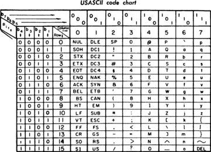

# Bytes

bytes - bits 'n' bytes made easy/easier incl. new buffer helper / wrapper class to help with the string byte vs character dichotomy

* home  :: [github.com/rubycocos/core](https://github.com/rubycocos/core)
* bugs  :: [github.com/rubycocos/core/issues](https://github.com/rubycocos/core/issues)
* gem   :: [rubygems.org/gems/bytes](https://rubygems.org/gems/bytes)
* rdoc  :: [rubydoc.info/gems/bytes](http://rubydoc.info/gems/bytes)


## Background -  Programming Bits, Bytes 'n' Blocks Step-by-Step Book / Guide

_Let's start with the three types of strings, that is, bytes, (string) buffers, and (frozen) strings, ..._


### Byte vs. Character


#### What's a Byte?

A byte is a 8-bit integer number (that is, unsigned from 0 to 255 or
signed from -128 to 127 using 2's complement).
Example:

``` ruby
0b01000001              #=> 65  - base 2  - binary bits
65                      #=> 65  - base 10 - decimal numbers
0x41                    #=> 65  - base 16 - hexadecimal numbers
[0b01000001, 65, 0x41]
#=> [65, 65, 65]
```

Or with conversions to 8-bit integer numbers. Example:

``` ruby
"01000001".to_i(2)     #=> 65
"65".to_i(10)          #=> 65
"65".to_i              #=> 65 - same as to_i(10)
"41".to_i(16)          #=> 65
"0x41".to_i(16)        #=> 65 - same as "41" - 0x hex prefix gets skipped
["01000001".to_i(2), "65".to_i(10), "41".to_i(16)]
#=> [65, 65, 65]
```

Note:  `String#hex` is a built-in short-cut / alias for `String#to_i(16)`.  Example:

``` ruby
"41".hex          #=> 65
"0x41".hex        #=> 65 - same as "41" - 0x hex prefix gets
```


#### What's a Character?

A character (or char) used to be a byte
and, thus, a string (array) of characters
was also an array of bytes. Example:

``` ruby
?A.ord        #=> 65 - ASCII character
"A".ord       #=> 65 - ASCII character
"\x41".ord    #=> 65 - ASCII character
[?A.ord, "A".ord, "\x41".ord]
#=> [65, 65, 65]
```


History Nostalgia Corner: ASCII 7-Bit Character Encoding



> ASCII abbreviated from American Standard Code for Information Interchange,
> is a character encoding standard for electronic communication. ASCII codes
> represent text in computers, telecommunications equipment, and other devices.
> Most modern character-encoding schemes are based on ASCII,
> although they support many additional characters.
>
> ASCII is the traditional name for the encoding system; the Internet Assigned
> Numbers Authority (IANA) prefers the updated name US-ASCII, which clarifies
> that this system was developed in the US and based on the typographical
> symbols predominantly in use there.
>
> (Source: [ASCII @ Wikipedia](https://en.wikipedia.org/wiki/ASCII))


Nowadays a character can have one, two or even more bytes.
Let's try:

``` ruby
## Latin Capital Letter A (Unicode) - 1 Byte
"A".bytes          #=> [65]
"\x41".bytes       #=> [65] - same as "A"
"\u0041".bytes     #=> [65]
"\u{41}".bytes     #=> [65] - same as "\u0041" - leading zeros can be dropped
"A".bytes.size     #=> 1
"A".chars.size     #=> 1

## Cyrillic Capital Letter A (Unicode) - 2 Bytes
"А".bytes          #=> [208, 144]
"\u0410".bytes     #=> [208, 144] - same "А"
"\u{410}".bytes    #=> [208, 144] - same as "\u0410" - leading zeros can be dropped
"А".bytes.size     #=> 2
"А".chars.size     #=> 1

# Old Persian Number One (Unicode) - 4 Bytes
"𐏑".bytes          #=> [240, 144, 143, 145]
"\u{103D1}".bytes  #=> [240, 144, 143, 145]
"\u{103d1}".bytes  #=> [240, 144, 143, 145] same as "\u{103D1}"
"𐏑".bytes.size     #=> 4
"𐏑".chars.size     #=> 1

# ...
```


### String of Bytes or String of Characters? Yes, Yes, Yes


In ruby the String class can morph into three types:

- Bytes
- Mutable String a.k.a String Buffer
- Immutable String a.k.a. Frozen String


#### Bytes / Binary


`String.new` or `"".b` creates new bytes, that is, a new binary string
buffer with the ASCII_8BIT encoding also known as BINARY.
Let's try:

``` ruby
String.new.encoding        #=> <Encoding::ASCII_8BIT>
String.new("".b).encoding  #=> <Encoding::ASCII_8BIT>
"".b.encoding              #=> <Encoding::ASCII_8BIT>

Encoding::BINARY == Encoding::ASCII_8BIT  #=> true

# or using the "type-safe" Bytes class

Bytes.new.encoding                  #=> <Encoding::ASCII_8BIT>
Bytes.new("").encoding              #=> <Encoding::ASCII_8BIT>
Bytes.new("abc").encoding           #=> <Encoding::ASCII_8BIT>
Bytes.new("\x61\x62\x63").encoding  #=> <Encoding::ASCII_8BIT>
```


#### String Buffer

If you use `String.new("")` (note the `""` passed in) or
the string literal `""` that creates a new string buffer
with the default encoding (usually UTF-8).
Let's try:

``` ruby
# encoding: utf-8
String.new("").encoding     #=> <Encoding::UTF_8>
"".encoding                 #=> <Encoding::UTF_8>
```

<!--

# or using the StringBuffer c'tor helper (returning a String)

StringBuffer.new.encoding         #=> <Encoding::UTF_8>
StringBuffer.new("").encoding     #=> <Encoding::UTF_8>
StringBuffer.new("abc").encoding  #=> <Encoding::UTF_8>

-->


#### Frozen String

If you use the recommended `# frozen_string_literal: true` magic comment
or pragma you can automagically turn all string literals into
frozen (immutable) strings with the default encoding (usually UTF-8).
Let's try:

``` ruby
# frozen_string_literal: true
"".frozen?                 #=> true
"Hello, World!".frozen?    #=> true
String.new.frozen?         #=> false
String.new("").frozen?     #=> false
```


<!--

### Bytes

bytes from hexstring

bytes to hexstring

bytes from string

bytes to string

bytes to array of integers

bytes from array of integers


#### Bytes to Integer Numbers - Little-Endian vs Big-Endian

4 byte unsigned integer  -

Example - 1

bytes to integer

integer to bytes

Big-End first or Little-End first?
Least significant bit (lsm) or most significant bit (msb) first?


#### Bytes Helper


### Buffer

#### Buffer Helper

-->


To be continued ...

---


## Usage

### BytesHelper  - From Bytes (Binary String) to Hex(adecimal) String and Back

``` ruby
require 'bytes

Bytes.bin_to_hex( "\x61\x62".b )
#=> '6162'

Bytes.hex_to_bin( '6162' )     # or
Bytes.hex_to_bin( '0x6162' )   # or
#=> "\x61\x62".b

Bytes.is_hex?( '6162' )
Bytes.is_hex?( '0x6162' )
Bytes.is_hex?( '' )     # empty string or
Bytes.is_hex?( '0x' )   # empty hex string
#=> true

Bytes.is_hex?( 'xyz' )
Bytes.is_hex?( '0xyz' )
#=> false

Bytes.hex_to_bin( 'xzy' )  # or
Bytes.hex_to_bin( '0xxzy' )
#=>  raises TypeError - non-hexadecimal digit found
```

Note:  You can use the shorter alternate alias
names  `btoh` or `htob`
for `bin_to_hex` and `hex_to_bin`.


Or use the mixed-in String class variants. Example:

``` ruby
"\x61\x62".b.bin_to_hex   # or
"\x61\x62".b.btoh
#=> '6162'

'6162'.hex_to_bin      # or
'6162'.htob            # or
'0x6162'.hex_to_bin    # or
'0x6162'.htob          # or
#=> "\x61\x62".b

'6162'.is_hex?
'0x6162'is_hex?
''.is_hex?        # empty string or
'0x'.is_hex?      # empty hex string
#=> true

'xyz'is_hex?
'0xyz'.is_hex?
#=> false

'xzy'.htob   # or
'0xxzy'.htob
#=>  raises TypeError - non-hexadecimal digit found
```

and so on.


## License


The `bytes` scripts are dedicated to the public domain.
Use it as you please with no restrictions whatsoever.


## Questions? Comments?

Send them along to the [wwwmake forum](http://groups.google.com/group/wwwmake).
Thanks!
